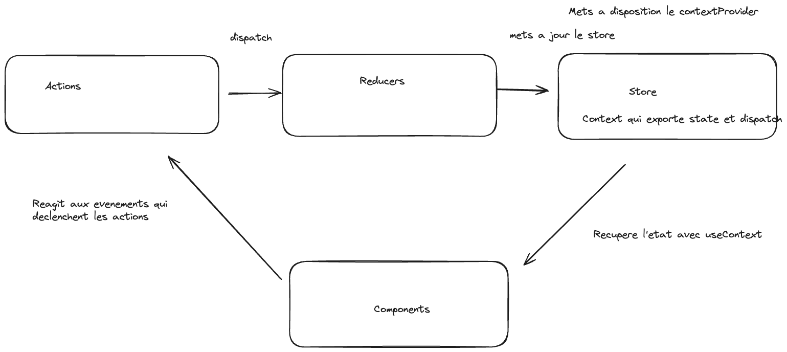

# Notes Autres
Dom = Document Object Model est une interface de programmation normalisée par le W3C, qui permet à des scripts d'examiner et de modifier le contenu du navigateur web.  
Dans le dev Js (react ou next) on a tendance à utiliser comme page principale une page "index" en html, c'est celle qui est affiché en permanence.  
On appel ce type d'application des "SPA"(Single-page application) car tout ce passe dans une seule page web, tout est simulé par la partie JS pour limiter les intéractions avec le serveur, l'inconvénient principal est que c'est le navigateur qui va se charger de tout(l'app peut donc consommer beaucoup de RAM).  
Lighthouse : plugin pour connaitre le référencement d'un site.  
Le TypeScript est une surcouche de JavaScript qui permet de typer les variables, cela rend le Js moins "libre" et plus encadré (utile uniquement pour le développeur, le client n'est pas impacté par le Ts).  
Outils autres : chadCN & Tailwind(css) & AG Grid(tab compatible avec react/js)  

# Partie React

## Intro
React est une bibliothèque JavaScript libre. Elle est maintenue par Meta ainsi que par une communauté de développeurs individuels et d'entreprises depuis 2013.

## Installation
npm create vite@latest my-react-app --template react  
cd my-react-app  
npm install  
npm run dev  

Vite sert a mettre en place son application, rapide et performant, il sert à faciliter le travail avec react.

### Infos et Voc Part-1
En react tous les composants sont des fonctions.  
Un composant est donc une fonction qui return du JSX.  
En React "<>" permet de rendre le DOM plu lisible.  
React mets à jour le DOM avec les hooks.  S
Hook permet de gérer l'état et le cycle de vie des rendues.  
Ce sont des fonctions qui commencent par use (convention).  
On peut utiliser une fonction pour mettre a jour le states.  
Cette syntaxe "setName((prev)=>{return prev + "vite";})" est utile quand on veut mettre un state dont la valeur depend de la valeur précédente.  
Les composants React communiquent entre eux avec des props.  
Tous les composants peuvent recevoir en parametre des props. 
Ce sont des objets dont l'utilisation est similaire a celle des attributs html.  
Les props sont utile lorsqu'on veut passer d'enfant à parents, au dela ils deviennent dépassés.  
La props "children" est présente dans tous les ocmposants de base.  

# Consignes TP React

## Partie 1
- [ ] Créer un nouveau projet React avec vite
- [ ] Créer un composant `App`
- [ ] Créer un composant `Header`
- [ ] Créer un composant `Footer`
- [ ] Créer un composant `Main` qui affiche un profil utilisateur
- [ ] Utilisez un formulaire dont l'affichage est conditionné par un bouton
- [ ] Le fromulaire doit permettre de modifier le profil utilisateur
- [ ] utilisez les modules CSS
- [ ] Utilisez les props
- [ ] Utilisez les states
- [ ] L'application doit etre responsive (mobile first)
// il me reste a rendre responsive l'app

## Partie 2
- [ ] Creer un nouveau projet React avec Vite
- [ ] Cette fois ci l'application permettra de gerer les elements d'une liste a l'aide d'un formulaire
- [ ] Créer un composant `List` qui affiche une liste de profil utilisateur
- [ ] Creer un formulaire qui permet d'ajouter un profil utilisateur à la liste
- [ ] Trouvez un moyen de filtrer la liste des profils par annee de naissance par exemple  
(tester useeffect, usecontext et api context.)  
(utiliser useReducer au lieu de useState.)  

### Infos et Voc Part-2
Useeffect : fait en sorte que quelquechose qui ne provient pas de react marche dans react.  
Utilité : placer tout ses "sideEffects".  
Systeme de login pour ne pas utiliser un systeme de props. 
Hook : fonction mis a disposition part la bibliotheque react qui permet de gérer les cycles de vies de composants react.
L'etat est géré par le hook.  
Reducer: The reducer function that specifies how the state gets updated. It must be pure, should take the state and action as arguments, and should return the next state. State and action can be of any types.  
HookUseReducer permet de récupérer le state dans sa version la plus récente.  
API context permet de partager une fonction reducer ou une variable dans toute l'application.  
-context provider = composant react  
-props.children -> a way to pass the state data to a component as the props  
Donc au lieu de state et useState utiliser plutot state et dispatch afin de rendre disponible un reducer ou une variable dans toute l'app.  
### Schéma :  
  

# Partie Next

## Intro
Next est un framework React qui permet de créer des applications Web.  
Le framework se charge d'apporter tous les outils de bunling, compilation et bien plus...  
Next utilise des composants react pour l'interface et apporte de l'optimisation pour le referencement ainsi qu'en performance.  
Next est open source (accessible sur gitHub).

## Principales fonctionnalités

- explications du professeur à insérer ici.  

## Installation

- explications du professeur à insérer ici.  

# Consignes TP Next

## Partie 1 - Tutoriel
Suivre le tuto